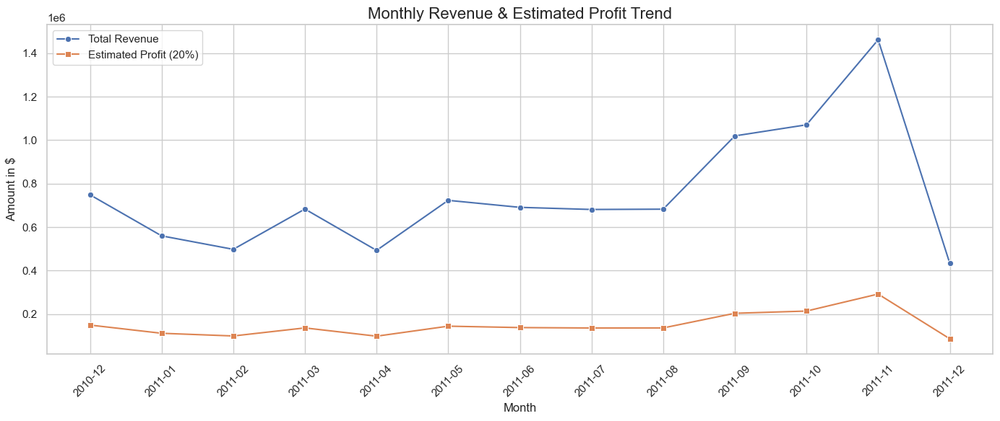
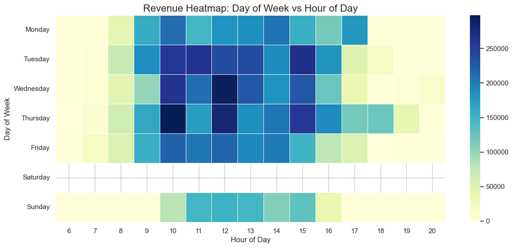
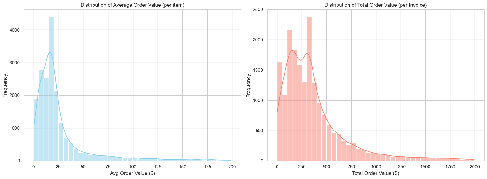
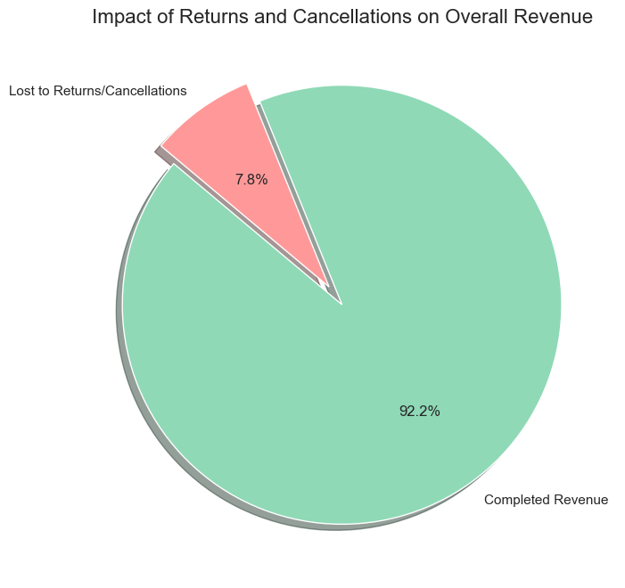
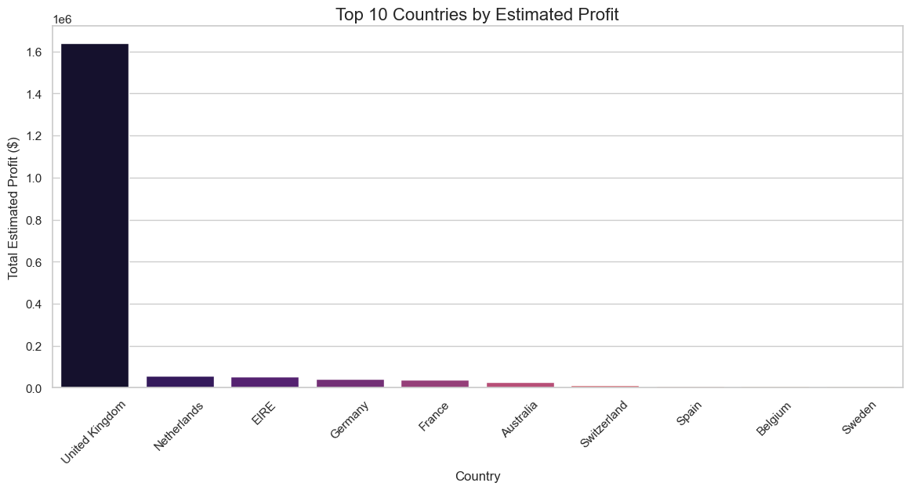

# Business Sales Performance Analytics

This repository contains the solution for the "Data Science & Analytics – Task 1 (2026)" by Future Interns.

## Project Overview
This project analyzes business sales data to uncover insights such as top-performing products, regional profitability, and sales trends over time. It includes generating realistic synthetic data, performing exploratory data analysis (EDA), and presenting the final insights in an interactive dashboard.

## Data Download Instructions
The dataset used in this project is the **Online Retail Dataset**. Due to its size, it is not included in this repository. 
You can download it from Kaggle:
[Online Retail Dataset on Kaggle](https://www.kaggle.com/datasets/ulrikthygepedersen/online-retail-dataset)

After downloading, please extract the `online_retail.csv` file and place it in the `data/` directory.

## Folder Structure
- `data/online_retail.csv`: The primary dataset for analysis (needs to be downloaded, see above).
- `EDA.ipynb`: Jupyter notebook containing data cleaning, exploration, and initial analysis (adapted for `online_retail.csv`).
- `PowerBI_Guide.md`: A step-by-step guide outlining how to build the required Power BI dashboard visuals using this dataset.

## How to Run The Project
1. **Download Data**: Follow the instructions above to download and place `online_retail.csv` in the `data/` directory.
2. **Explore Analysis**: Open `EDA.ipynb` in your preferred Jupyter environment to see trends from `online_retail.csv`.
2. **Open Dashboard**: Build or open your `.pbix` file in Microsoft Power BI Desktop to view the interactive visualizations.

## Tools & Tech Stack
- **Python**: Data generation, EDA, and preprocessing.
- **Power BI**: Interactive business dashboard and reporting.

## Key Insights & Recommendations
The primary insights, answering questions such as *Which products generate the most revenue?* and *Where should the business focus to grow faster?*, are thoroughly documented within the "Business Insights" tab of the interactive Streamlit dashboard.

## Exploratory Data Analysis Visualizations
Here are some of the key plots and graphs generated during the EDA phase:

### Plot 1

### Plot 2

### Plot 3

### Plot 4

### Plot 5

